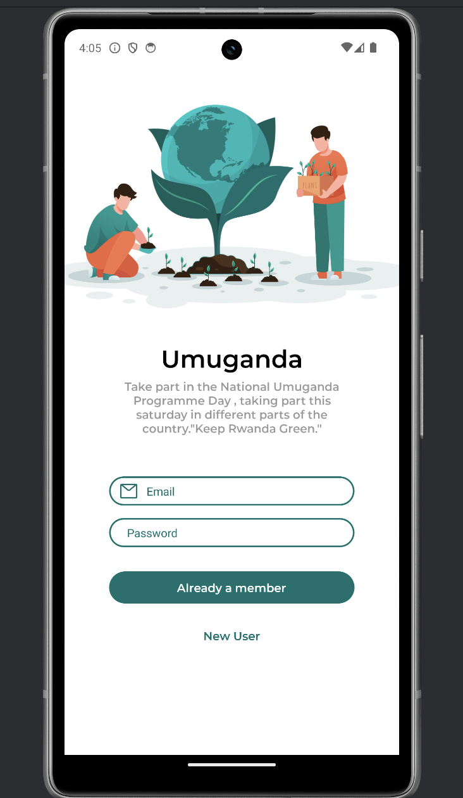

# Umuganda-app
  
    

  
  ## Table Of Content

  - [Description](#description)
  
  - [Installation](#installation)
  - [Usage](#usage)
  - [Contributing](#contribution)
  - [Tests](#tests)
  - [GitHub](#github)
  - [Contact](#contact)
  - [License](#license)
  

  
  

    

  
  ## Description

    Project Description:
The Umuganda app is a mobile application designed to facilitate communication and collaboration among users who are passionate about environmental conservation and community engagement in Rwanda.

Motivation:
The motivation behind the Umuganda app was to leverage technology to empower individuals and communities to actively participate in environmental conservation efforts. Rwanda has a strong tradition of Umuganda, a monthly community service where citizens come together to work on various projects for the common good. This app aims to modernize and extend the spirit of Umuganda to address contemporary environmental challenges.

Purpose:
The primary purpose of the Umuganda app is to create a platform for users to engage in meaningful discussions, share ideas, and coordinate activities related to environmental stewardship. By fostering a sense of community and collective responsibility, the app encourages users to take proactive steps towards preserving Rwanda's natural heritage.

Problem Solving:
The Umuganda app addresses several key challenges:

Communication and Collaboration: It provides a centralized platform for users to connect with like-minded individuals, organizations, and local authorities, facilitating collaboration on environmental projects and initiatives.

Information Access: The app serves as a valuable resource hub, offering information, tips, and resources on environmental conservation practices, tree planting, waste management, and pollution prevention.

Community Engagement: By encouraging user participation and interaction, the app promotes a sense of community ownership and responsibility for environmental stewardship, leading to increased engagement in conservation activities.

Learning Outcomes:
In developing the Umuganda app, several important lessons were learned:

Community Empowerment: The project underscored the importance of community involvement and grassroots initiatives in driving meaningful change.
Technology as a Catalyst: It demonstrated how technology can be leveraged to mobilize and empower communities, fostering collaboration and collective action.
Environmental Awareness: Building the app deepened understanding of environmental issues and highlighted the importance of education and outreach in promoting sustainable practices.
Summary:
Overall, the Umuganda app represents a digital extension of Rwanda's Umuganda tradition, harnessing the power of technology to unite communities, inspire action, and create a brighter, more sustainable future.

  

  

  
  

  

     
  mobile-app.png
  

  

  

  ## Installation

  Install Node.js and npm: Ensure that Node.js and npm are installed on your system. You can download and install them from the official Node.js website: Node.js Downloads.

Clone the Repository: Clone the repository containing your project files to your local machine using Git. You can use the following command in your terminal:
git clone <repository-url>

Navigate to Project Directory: Open your terminal and change the directory to the project directory using the cd command:
cd my-app

Install Dependencies: Run the following command to install the project dependencies listed in the package.json file:
npm install

This command will install all the necessary dependencies required for your project, including React Native, Expo, and other packages.

Start the Application: Once the dependencies are installed, you can start the application using Expo. Run one of the following commands based on your target platform:

For Android:
npm run android

For iOS:
npm run ios

For Web:
npm run web

This will launch the development server and open your app in the Expo client on your device or emulator.

  

  
  Umuganda-app is built with the following tools and libraries: <ul><li>React Native</li><li>Expo</li><li>@react-native-community/masked-view</li><li>@react-navigation/native</li><li>expo-status-bar</li><li>react-native-gesture-handler</li><li>react-native-reanimated</li><li>react-native-safe-area-context</li><li>react-native-screens</li><li>react-navigation-stack</li><li>inquirer (for CLI prompts)</li><li>@babel/core (as a dev dependency)</li></ul>
  

  

  ## Usage
 
  Usage Information:

To run this project locally, follow these steps:

Clone the repository to your local machine.
Navigate to the project directory using your terminal.
Install the required dependencies by running npm install.
Once the dependencies are installed, you can start the development server using one of the following commands:
npm start to start the Expo development server.
npm run android to start the app on an Android emulator/device.
npm run ios to start the app on an iOS simulator/device.
npm run web to start the app in a web browser.
Make sure you have Node.js and Expo CLI installed on your machine before proceeding with the installation steps.

For more information on running and building Expo projects, refer to the official Expo documentation: https://docs.expo.dev/.

  

  

  ## Contribution
 
  Contribution Guidelines:

Thank you for considering contributing to this project! Contributions are welcome and appreciated.

To contribute to this project, please follow these guidelines:

Fork the repository on GitHub.
Clone the forked repository to your local machine.
Create a new branch for your feature or bug fix: git checkout -b feature/your-feature-name.
Make your changes in the new branch.
Test your changes thoroughly.
Commit your changes with descriptive commit messages: git commit -am 'Add new feature'.
Push your changes to your fork: git push origin feature/your-feature-name.
Submit a pull request to the main repository's main branch.
Please ensure that your code adheres to the project's coding standards and conventions. Also, make sure to include appropriate documentation and test cases for your changes.

If you have any questions or need assistance with the contribution process, feel free to reach out to the project maintainers.

Thank you for your contribution!

  

  

  ## Tests
 
  Test Instructions:

To test this project, follow these steps:

Clone the repository to your local machine.
Navigate to the project directory in your terminal.
Install dependencies using the package manager of your choice (npm or yarn):
Copy code
npm install
or
Copy code
yarn install
Start the development server:
sql
Copy code
npm start
or
sql
Copy code
yarn start
Open the application in your preferred web browser or mobile simulator.
Verify that the application functions as expected, including all features and user interactions.
If you encounter any issues, troubleshoot them or report them to the project maintainers.
Thank you for testing the project! Your feedback is valuable in improving the quality of the application.

  

  

  ## GitHub

  <a href="https://github.com/Paccyfic"><strong>Paccyfic</a></strong>
  

  
  
  

  ## Contact

  Feel free to reach out to me on my email:
  ndahiropacific@gmail.com
  

  

  ## License

  
  

  
